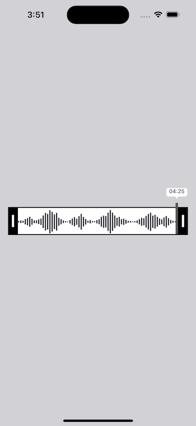

# TRAudioTrimmer

 Simple audio trimmer app for iOS.




## Usage

```
        let url = Bundle.main.url(forResource: "Aadat", withExtension: "mp3")
        let audioAsset = AVAsset(url: url!)
        trimView.asset = audioAsset
        trimView.delegate = self
```
Access the `startTime` and `endTime` property to know where to trim your asset via `TRAudioTrimmerViewDelegate`

```
   func didChangePositionBar(_ playerTime: CMTime) {
        
    }
    
    func positionBarStoppedMoving(_ playerTime: CMTime) {
        let startTime = trimView.startTime!.seconds
        let endTime = trimView.endTime!.seconds
        print("Start Time : ",startTime)
        print("End Time : ",endTime)
    }
```


## Author

Nurul Amin Khandaker [Tush@r]
